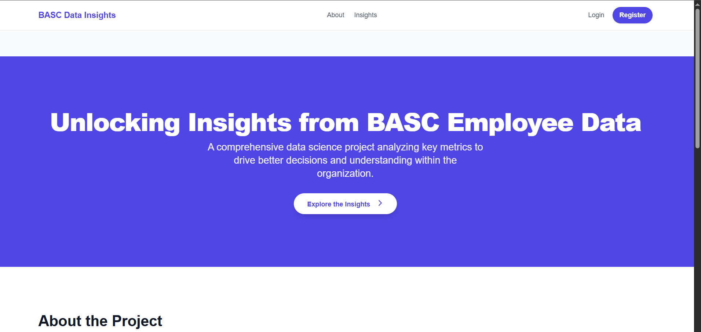

# 📊 BASC Employee Data Insights

This project is a Django-based data analytics web application that provides insights into the employee demographics and gender profile at Bulacan Agricultural State College (BASC).

It connects to an existing MySQL database containing employee records and allows visual exploration of the data through charts and dashboards.

---

## 🔧 Tech Stack

| Tool                 | Purpose              |
| -------------------- | -------------------- |
| `Python`             | Backend logic        |
| `Django`             | Web framework        |
| `MySQL`              | Database             |
| `Chart.js`           | Data visualization   |
| `Power BI`           | External dashboarding|
| `HTML/CSS/JS`        | Frontend UI          |
| `Git`                | Version control      |

---

## 🧱 Features

- ✅ Gender distribution and insights dashboard  
- ✅ Employee profile analytics by department, age, and service  
- ✅ Connects to a real MySQL database  
- ✅ Clean modular Django app structure  
- ✅ Ready for integration with Power BI or Python ML scripts

---


## 📸 Screenshots

### Landing Page


---

## 🛠️ Setup Instructions

### 1. 📥 Clone the Repository

```bash
git clone https://github.com/yourusername/basc-employee-insights.git
cd basc-employee-insights

### 2. 🐍 Create and Activate Virtual Environment
python -m venv venv
venv\Scripts\activate  # On Windows

### 3. 📦 Install Requirements
pip install -r requirements.txt
### manually install it
pip install django mysqlclient


### 4. ⚙️ Connect to the database
DATABASES = {
    'default': {
        'ENGINE': 'django.db.backends.mysql',
        'NAME': 'datascience',
        'USER': '',
        'PASSWORD': '',
        'HOST': 'localhost',
        'PORT': '3306',
        'OPTIONS': {
            'init_command': "SET sql_mode='STRICT_TRANS_TABLES'",
        },
    }
}

### 5. 🔧 Migrate Without Affecting Existing Data

python manage.py migrate --fake
### Or just for the app:
python manage.py migrate main_app --fake

### 6. 🚀 Run the Development Server
python manage.py runserver


👨‍💻 Author
Developed by: [JOMEL M. MAJAIT],[John Jermaine Sison],[Angelo De Leon]
BASC Data Science Practice – 2025